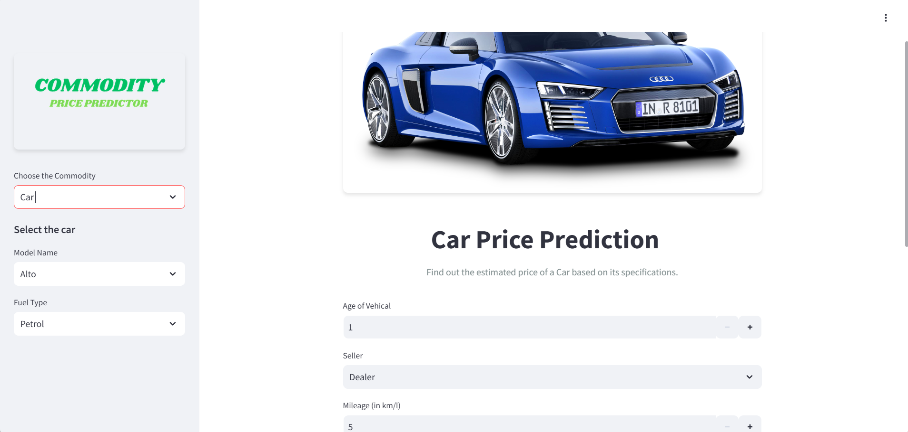
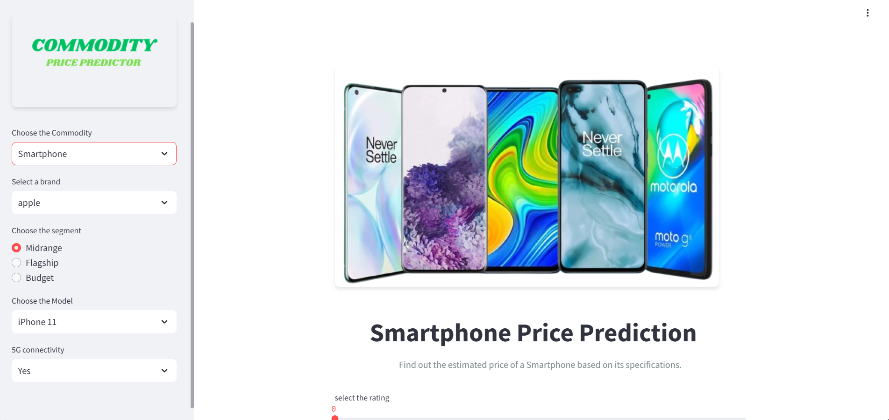
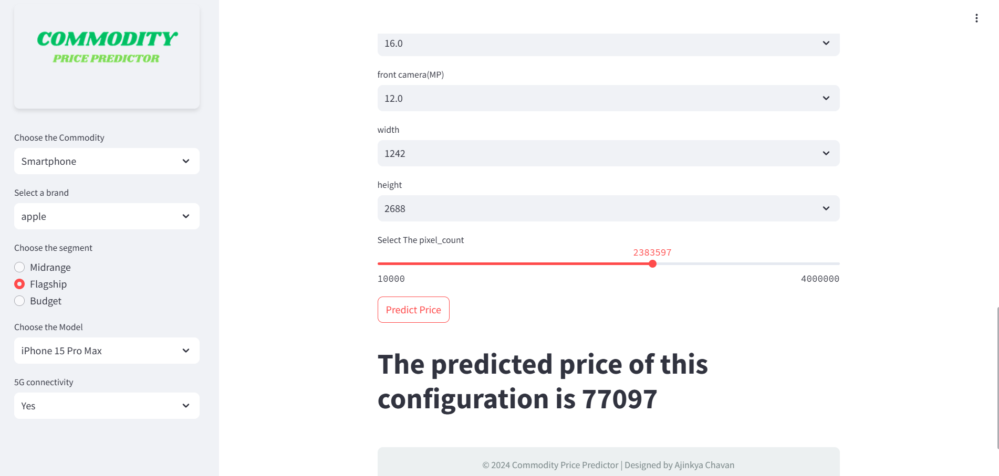

# Commodity Price Predictor


The **Commodity Price Predictor** is a web-based application designed to estimate the price of three key commodities: **Laptops**, **Cars**, and **Smartphones**, based on user-provided specifications. This tool leverages machine learning models to provide accurate price predictions, making it an invaluable resource for users planning to purchase or evaluate these items.

### deployment link - https://commodity-price-predictor-eel3.onrender.com

---
## Logo
  

## Features

- **Three Commodity Support**: Predict prices for laptops, cars, and smartphones.
- **User-Friendly Interface**: Interactive and intuitive inputs using Streamlit.
- **Accurate Price Prediction**: Employs tailored machine learning models for each commodity:
  - **Laptop**: Random Forest Regressor.
  - **Car**: XGBoost.
  - **Smartphone**: Random Forest Regressor.
- **Efficient Compression**: Uses GZIP to compress large machine learning models like `car_pipe.pkl` for faster loading and optimized storage.
- **Deployment**: Hosted on the **Render** platform for easy access.
- **Customizable Inputs**: Dynamic input fields based on the commodity selected.
- **Professional Styling**: Responsive and visually appealing interface with CSS for enhanced user experience.
- **License**: Distributed under the **MIT License**.

---

## Installation

1. Clone the repository:
   ```bash
   git clone https://github.com/yourusername/commodity-price-predictor.git
   cd commodity-price-predictor
   ```
2. Install dependencies:
   ```bash
   pip install -r requirements.txt
   ```
3. Run the application:
   ```bash
   streamlit run app3.py
   ```

---

## Usage

1. Choose a commodity (**Laptop**, **Car**, or **Smartphone**) from the sidebar.
2. ## Usage
1. **Laptop Prediction Interface**:
   
3. Fill in the required specifications:
   - For **Laptops**: Brand, type, RAM, touchscreen, resolution, etc.
   - For **Cars**: Model, fuel type, age, mileage, etc.
   - For **Smartphones**: Brand, processor, RAM, camera specs, etc.
2. **Car Prediction Interface**:
   

4. Click the **Predict Price** button.
5. 3. **Smartphone Prediction Interface**:
   
6. View the predicted price displayed on the screen.
   


---

## Technical Details

### Models and Libraries
- **Libraries**: `streamlit`, `scikit-learn`, `pandas`, `numpy`, `gzip`.
- **Laptop**: Random Forest Regressor model (`pipe.pkl`).
- **Car**: XGBoost model (`car_pipe.pkl.gz`).
- **Smartphone**: Random Forest Regressor model (`smpipe.pkl`).

### Architecture
1. **Frontend**: Streamlit-based interface with custom CSS for styling.
2. **Backend**:
   - Helper functions in `helper.py` for dynamic filtering and preprocessing.
   - Models loaded from pickle files (compressed for efficiency).
3. **Prediction**:
   - Input features are processed and passed to the respective machine learning model.
   - The predicted price is displayed after computation.

### Deployment
Deployed on **Render**, ensuring availability across devices.

---

## Project Structure

```plaintext
|-- app3.py                 # Main application script
|-- helper.py               # Helper functions for filtering and preprocessing
|-- styles.css              # CSS for styling the application
|-- requirements.txt        # Required Python libraries
|-- models/                 # Directory containing pre-trained models
    |-- pipe.pkl            # Laptop model
    |-- smpipe.pkl          # Smartphone model
    |-- car_pipe.pkl.gz     # Compressed Car model
|-- data/                   # Directory for datasets (if any)
```

---

## Future Enhancements

- Add support for more commodities (e.g., appliances, furniture).
- Implement a recommendation system based on user preferences.
- Include real-time market data for more accurate predictions.
- Optimize the app further for mobile devices.

---

## License

This project is licensed under the [MIT License](https://opensource.org/licenses/MIT).

---

## Acknowledgments

- Inspired by real-world e-commerce needs.
- Special thanks to the **Render** platform for deployment.

